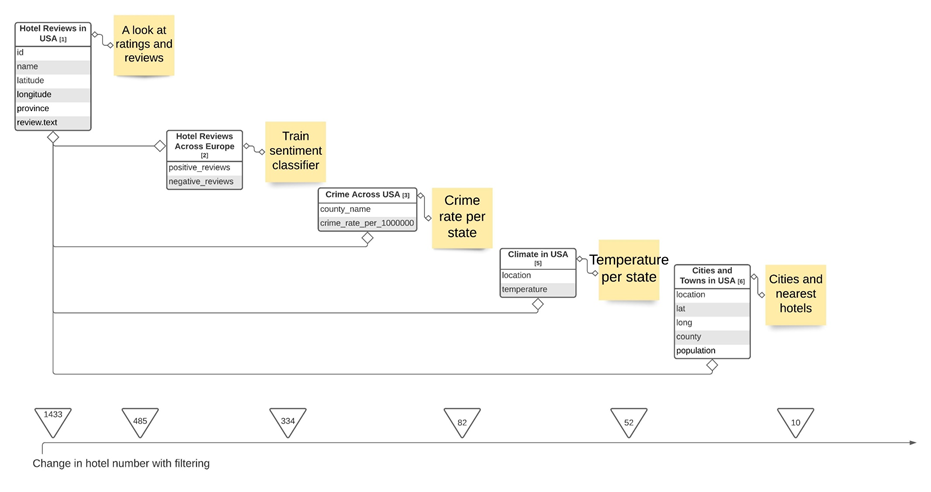

# Best-Hotels-in-the-USA

**Themes**: Python, Folium Maps, R, Photoshop/Paint, Visualization and Data analysis

### Project Summary

This project provides an example of the work layout that I use for my reports, which is available for viewing in the  pdfs attached (Visualization Project).

The goal behind this project is to bring a new perspective into how data can be used to take finding a hotel to stay at to different level beyond common site filters. I had used review, climate, crime and geographic data from a range of sources to filter out the desired hotels. However, the same process can be repeated with different data depending on personal preferences.

### Results

The following image is a dashboard containing the major visualization and tables I had used to determine appropriate hotels to stay at.

Lastly below shows a simplified diagram of how I had used the different data sources to filter out hotels.

### Structure and Procedures

 1. Visualization plan and data collection
  
   * This process began with an overview plan and preliminary data exploration of the data that I have and may need in order to determine what is feasible to told as a story in the report. The majority of the data is sourced from Kaggle and the National Oceanic and Atmospheric Administration.
 
 2. Data cleaning and pre-processing
 
   * Here I created new data tables with queries in Python and R in order to create the appropriate visualizations later on and prepared a subset of data to train the sentiment classifier.
 
 3. Training a sentiment classifier
 
   * Within the scope of the project, a simple classifier was created using the bag of words architecture for a text classifier model of positive and negative reviews. Future models can be improved with more relevant data and the use of transfer learning as there is a slight difference between the context of reviews for training and prediction.
 
 4. Creating the visualizations
   * Geospatial visualizations were created primarily using Folium Maps in python with others required for analysis done in R's ggplot package and Tableau. Each visualization is aimed at helping to describe the reasoning behind why some hotels were selected or not through a process of gradual reduction based on four criteria. Hotels must have good reviews, be in a safe area, have good weather during dates that might visited and to have plenty of cities to visit.

